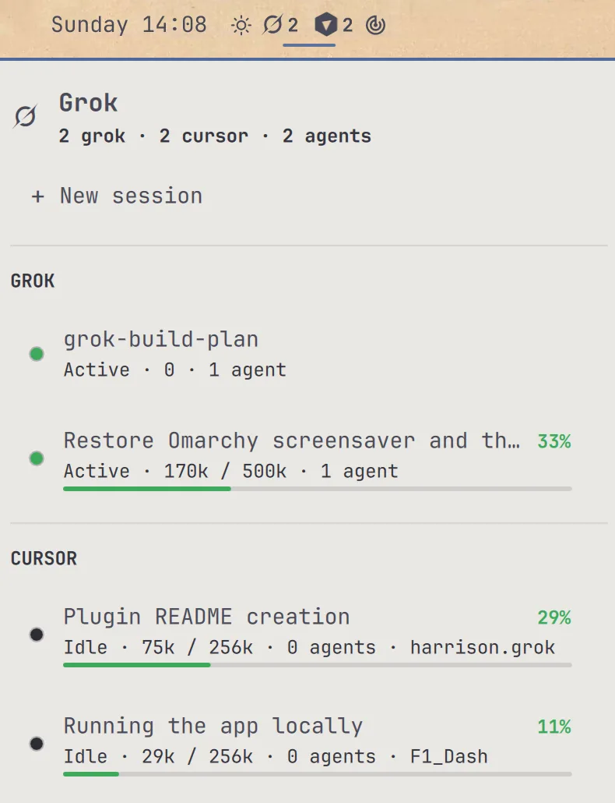

# grok.bar

A center-bar launcher for [Omarchy](https://omarchy.org/) Quattro. It lists live Grok TUIs and Cursor agent chats, shows status and context use, and jumps you back into the matching window.

Plugin id: `io.github.hwpaige.grok-bar`.



## Features

- Grok and Cursor counts on the bar, each with its own mark
- Session menu split into **GROK** and **CURSOR**, with title, status, agents, and workspace
- Context use as `used / window`, a percent, and a color bar (green / yellow / red)
- Click a Grok row to focus its window, or resume the session if it is gone
- Click a Cursor row to focus that chat, or reopen Cursor in the same folder
- Right-click starts a new Grok TUI with no inner padding
- `grok` on PATH and Omarchy’s TUI launcher also open padless Grok windows
- Keyboard navigation (arrows, Enter, Escape)
- New Grok windows open in `~/Projects` (then `~/Work`, then `$HOME`)

## Requirements

- Omarchy Quattro with the shell bar
- The real `grok` CLI installed (`~/.grok/bin/grok` or `/usr/bin/grok`)
- Python 3
- Hyprland (`hyprctl`) so live windows can be focused
- A terminal: foot, Alacritty, kitty, or Ghostty
- Cursor is optional; agent chats appear when it is installed

## Install

From a git remote:

```sh
omarchy plugin add https://github.com/hwpaige/grok.bar.git --enable
~/.config/omarchy/plugins/io.github.hwpaige.grok-bar/install.sh
```

`omarchy plugin add` clones the plugin into `~/.config/omarchy/plugins/io.github.hwpaige.grok-bar/` and can enable the widget. It does not run install hooks. `install.sh` only puts helpers on `PATH` and writes `~/.config/foot/grok.ini` (`pad=0x0`).

From this folder (no git required):

```sh
./install.sh
```

That also symlinks this checkout into the plugins directory when that path is empty, then places the widget next to the clock if it is not already on the bar. It will not replace an existing `omarchy plugin add` checkout with a symlink.


Helpers installed to `~/.local/bin`:

- `omarchy-grok-sessions` — live Grok and Cursor snapshot for the bar
- `omarchy-launch-grok` — new session, focus, or resume from the menu
- `omarchy-grok-term` — Grok in a zero-padding terminal
- `grok` — wrapper so interactive `grok` also gets a padless window
- `omarchy-launch-tui` — same padless Grok when Omarchy launches the TUI

`~/.local/bin` must be on your `PATH`, ahead of `/usr/bin`, so the wrappers win.

## Usage

- **Left-click** the Grok mark: open the session menu
- **Right-click**: start a new Grok window
- Grok count is beside the Grok mark; Cursor count is beside the Cursor mark
- Click a **GROK** row to focus or resume that TUI
- Click a **CURSOR** row to focus the matching Cursor window
- Hover a row and click the trash mark to delete it (`x` does the same)
- Grok sessions are removed with `grok sessions delete`; Cursor chats are archived and hidden
- Arrow keys move, Enter activates, Escape closes

Each row shows title, status, context usage, and agent count. Status colors:

- Green: active
- Yellow: waiting
- Red: error
- Dim: idle

Context percent turns yellow at 70% and red at 90%.

## Permissions

New and resumed Grok sessions launch with `grok --permission-mode bypassPermissions`. The plugin does not use `sudo`. Helpers run as your user, read `~/.grok` session files, read Cursor’s `state.vscdb` in read-only mode when present, and query `hyprctl clients` to match windows.

## Configure

```sh
omarchy bar move io.github.hwpaige.grok-bar --section center
```

## Remove

```sh
omarchy plugin remove io.github.hwpaige.grok-bar
```

Then delete the helpers if you no longer need them:

```sh
rm -f ~/.local/bin/omarchy-grok-sessions ~/.local/bin/omarchy-launch-grok \
  ~/.local/bin/omarchy-grok-term ~/.local/bin/grok ~/.local/bin/omarchy-launch-tui \
  ~/.config/foot/grok.ini
```
